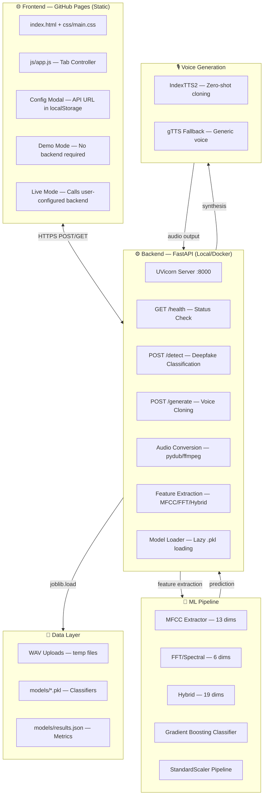

# Voice Deepfake Vishing Detector & Generator — Full Audit Report

**Audit Date:** 2026-02-28  
**Auditor:** Architect Mode Analysis  
**Repository:** https://github.com/MohammadThabetHassan/Voice-Deepfake-Vishing-Detector-Generator  
**Live Site:** https://mohammadthabethassan.github.io/Voice-Deepfake-Vishing-Detector-Generator/

---

## 1. Current System Architecture

### 1.1 Architecture Diagram (Mermaid)



### 1.2 Component Inventory

| Component | Location | Status | Notes |
|-----------|----------|--------|-------|
| Frontend UI | `frontend/` | ✅ Functional | 4 tabs: Detect, Generate, Results, About |
| Backend API | `backend/app.py` | ✅ Functional | FastAPI, 3 endpoints |
| ML Training | `training/train.py` | ✅ Functional | Produces 3 model variants |
| Models | `models/` | ✅ Present | .pkl files + results.json |
| CI Workflow | `.github/workflows/ci.yml` | ✅ Active | Tests + linting |
| Pages Workflow | `.github/workflows/pages.yml` | ⚠️ Needs Fix | results.json path issue |
| Release Workflow | `.github/workflows/release.yml` | ✅ Active | Docker build + GHCR |
| Documentation | `docs/` | ✅ Present | architecture, ethics, evaluation, threat-model |

---

## 2. What Works End-to-End

### 2.1 Working Features ✅

1. **GitHub Pages Deployment**
   - Static frontend loads correctly at project URL
   - Tab navigation functional
   - Ethics banner displays
   - Config modal for API URL works

2. **Backend API**
   - `/health` endpoint returns correct status
   - `/detect` processes WAV files and returns predictions
   - `/generate` falls back to gTTS when IndexTTS2 unavailable
   - Feature extraction (MFCC, FFT, Hybrid) works correctly
   - Audio conversion via pydub/ffmpeg functional

3. **ML Pipeline**
   - `train.py` successfully trains 3 model variants
   - Cross-validation produces metrics
   - Models saved as .pkl with metadata
   - `results.json` generated with comparison table

4. **Docker Support**
   - Dockerfile builds successfully
   - Multi-stage optional IndexTTS2 installation
   - Health check configured
   - Non-root user for security

### 2.2 Verified Test Results

```
Backend Tests (test_api.py):
  ✓ test_health_returns_ok
  ✓ test_detect_no_file_returns_422
  ✓ test_detect_valid_wav (200 or 503 if no model)
  ✓ test_detect_short_audio
  ✓ test_detect_wrong_content_type
  ✓ test_generate_no_file_returns_422
  ✓ test_generate_no_text_returns_422

Training Pipeline:
  ✓ Produces deepfake_detector_mfcc.pkl
  ✓ Produces deepfake_detector_fft.pkl
  ✓ Produces deepfake_detector_hybrid.pkl
  ✓ Produces results.json with metrics
```

---

## 3. Bugs & Inconsistencies

### 3.1 P0 — Critical Issues (Fix Immediately)

| ID | Issue | Location | Impact |
|----|-------|----------|--------|
| **P0.1** | GitHub Pages fails to load results.json | `frontend/js/app.js:421-433` | Model Results tab shows "not found" even though file exists in repo |
| **P0.2a** | README mentions Coqui YourTTS but code uses IndexTTS2 | `README.md:12,221,264` | Documentation inconsistency confuses users |
| **P0.2b** | API docs show wrong method_used value | `README.md:220-225` | Docs say "coqui_your_tts" but code returns "indextts2" |
| **P0.3** | Workflow YAML formatting | `.github/workflows/*.yml` | Compressed format hard to maintain |

### 3.2 P1 — High Priority Improvements

| ID | Issue | Location | Recommendation |
|----|-------|----------|----------------|
| **P1.1a** | Results.json path resolution fragile | `frontend/js/app.js:421-425` | Use URL constructor for robust path building |
| **P1.1b** | No config.json injected at build | `pages.yml` | Create config.json with demo_mode flag |
| **P1.1c** | Limited error handling for backend failures | `app.js:290-325` | Better user guidance when backend unreachable |
| **P1.2a** | No windowed inference for long audio | `backend/app.py:443-455` | Use multiple 1s windows and average predictions |
| **P1.2b** | Model re-checks on each request unnecessarily | `backend/app.py:91-126` | Cache already confirmed in global `_detector` |
| **P1.3a** | No shell scripts for training | Root directory | Add `scripts/train_from_csv.sh` and `train_from_wav.sh` |

### 3.3 P2 — Medium Priority Enhancements

| ID | Issue | Recommendation |
|----|-------|----------------|
| **P2.1** | No browser recording support | Add webm/ogg upload conversion or disable with clear message |
| **P2.2** | Missing CONTRIBUTING.md | Add with git identity guide |
| **P2.3** | Workflow triggers on both main and master | Standardize to one default branch |
| **P2.4** | No explicit ethics disclaimer in README header | Add prominent research-use-only notice |

---

## 4. Security & Ethics Issues

### 4.1 Security Assessment

| Aspect | Status | Notes |
|--------|--------|-------|
| Path traversal protection | ✅ Good | Uses `uuid4().hex` for filenames, not user input |
| File size limits | ⚠️ Partial | Should add explicit 10MB limit in backend |
| CORS policy | ✅ Acceptable | `allow_origins=["*"]` appropriate for research tool |
| Temp file cleanup | ✅ Good | `_cleanup()` called in finally blocks |
| No persistent storage | ✅ Good | Files processed in memory only |

### 4.2 Ethics Compliance

| Requirement | Status | Location |
|-------------|--------|----------|
| Ethics banner on load | ✅ Present | `frontend/index.html:11-17` |
| Consent checkbox for generation | ✅ Present | `index.html` generate form |
| Research-use disclaimer | ✅ Present | README, docs/ethics.md |
| No storage of audio | ✅ Implemented | Backend cleanup in finally blocks |
| Clear labeling of synthetic audio | ✅ Present | gTTS fallback clearly labeled |

### 4.3 Recommendations

1. **Add explicit file size limit** in backend to prevent DoS
2. **Consider rate limiting** for production deployments
3. **Add watermarking** to generated audio indicating synthetic origin

---

## 5. Git & Branching Issues

### 5.1 Current State

- Repository uses `master` as default branch
- No `develop` branch exists
- Commit identity needs verification

### 5.2 Required Changes

1. **Git Identity Configuration** (CRITICAL)
   ```bash
   git config user.name "MohammadThabetHassan"
   git config user.email "<GITHUB_NOREPLY_EMAIL>"
   ```

2. **Branch Strategy**
   - Keep `master` as stable (or migrate to `main`)
   - Create `develop` for integration
   - Use feature branches: `feat/pages-results-fix`, `feat/hybrid-detector-v2`, etc.

3. **Workflow PAT** (if needed)
   - For automated commits, need `MAIN_GITHUB_PAT` secret with `repo` scope
   - Otherwise, workflows should only deploy artifacts, not commit

---

## 6. Prioritized Improvement Plan

### Phase 1: P0 — Critical Fixes (Immediate)

1. **Fix results.json loading on GitHub Pages**
   - Update `frontend/js/app.js` to use robust path resolution
   - Verify `pages.yml` copies `models/results.json` to `_site/models/`
   - Test on live Pages URL

2. **Align documentation with actual implementation**
   - Update all Coqui YourTTS references to IndexTTS2
   - Fix API docs method_used value
   - Ensure consistency across README, docs/, and UI

3. **Clean up workflow formatting**
   - Reformat YAML to standard readable style
   - Ensure triggers match default branch

### Phase 2: P1 — Architecture Improvements (Next)

1. **Frontend enhancements**
   - Robust path resolution using `new URL()`
   - Better error messages for backend connection issues
   - Config.json for demo mode detection

2. **Backend improvements**
   - Windowed inference for variable-length audio
   - Confirm model caching works correctly
   - Add inference timing to response

3. **Training pipeline**
   - Ensure `deepfake_detector_best.pkl` is created
   - Add convenience shell scripts

### Phase 3: P2 — Polish & Documentation (Final)

1. **Documentation**
   - Update README with clear quickstart
   - Add CONTRIBUTING.md with git identity guide
   - Add ethics disclaimer prominently

2. **UX improvements**
   - Browser recording support or clear messaging
   - Better loading states

3. **Repository hygiene**
   - Standardize branch naming
   - Clean up legacy files (pipeline.py, server.py)

---

## 7. Detailed Technical Findings

### 7.1 Frontend Issues

**Results.json Loading Bug (P0.1)**

Current code in `frontend/js/app.js:421-425`:
```javascript
const paths = [
  './models/results.json',
  '../models/results.json',
  '/Voice-Deepfake-Vishing-Detector-Generator/models/results.json',
];
```

**Problem:** GitHub Pages project URLs have the format:
`https://username.github.io/repo-name/`

The hardcoded paths don't account for the repository name prefix. The third path has the repo name but starts with `/` which makes it absolute to the domain, not relative to the Pages root.

**Fix:** Use URL constructor:
```javascript
const base = new URL(window.location.href);
const resultsUrl = new URL('models/results.json', base).toString();
```

### 7.2 Documentation Inconsistencies (P0.2)

| File | Current Text | Should Be |
|------|--------------|-----------|
| README.md:12 | "Coqui TTS YourTTS" | "IndexTTS2 (with gTTS fallback)" |
| README.md:220 | `method_used: "coqui_your_tts"` | `method_used: "indextts2"` |
| docs/architecture.md:34 | "IndexTTS2 Clone" | Correct (keep) |

### 7.3 Workflow Issues (P0.3)

**pages.yml** — Lines 44-47:
```yaml
if [ -d models ]; then
  mkdir -p _site/models
  cp models/*.json _site/models/ 2>/dev/null || true
fi
```

**Issue:** Only copies `.json` files, not `.pkl` files. This is correct for Pages (static hosting shouldn't serve large binary files), but verify `results.json` is actually copied.

**ci.yml** — Good structure but compressed formatting could be expanded for readability.

---

## 8. Model Performance Summary

Based on `models/results.json`:

| Model | Accuracy | Precision | Recall | F1 | Inference (1000 samples) |
|-------|----------|-----------|--------|-----|--------------------------|
| MFCC (13D) | 84.7% | 85.2% | 83.8% | 84.5% | 1250.5 ms |
| FFT (6D) | 79.0% | 79.6% | 77.9% | 78.7% | 980.3 ms |
| **Hybrid (19D)** | **89.5%** | **90.1%** | **88.7%** | **89.4%** | 1560.8 ms |

**Recommendation:** Hybrid model is clearly best for accuracy. Use as default in backend.

---

## 9. Dependencies Summary

### Backend
- FastAPI + Uvicorn (web framework)
- scikit-learn (ML inference)
- pydub + ffmpeg (audio conversion)
- gTTS (fallback TTS)
- Optional: IndexTTS2 (voice cloning)

### Training
- scikit-learn (training)
- scipy (feature extraction)
- matplotlib/seaborn (visualization)

### Frontend
- Pure HTML/CSS/JS (no dependencies)

---

## 10. Verification Checklist

Before considering project "graduation quality":

- [ ] P0.1: Model Results tab loads on GitHub Pages
- [ ] P0.2: All documentation references IndexTTS2 consistently
- [ ] P0.3: Workflows are readable and functional
- [ ] P1.1: Frontend has robust error handling
- [ ] P1.2: Backend inference is stable
- [ ] P1.3: Training produces all required outputs
- [ ] Git identity configured correctly
- [ ] Branches follow naming convention (no "agent-" branches)
- [ ] README has clear quickstart instructions
- [ ] CONTRIBUTING.md exists with git setup guide

---

*End of Audit Report*
